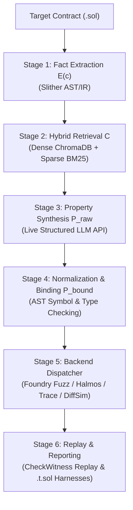

# SpecGuard-AA: Formal Specification Mining & Automated Bug Verification for ERC-4337 Account Abstraction

[](file:///c:/Users/gkrmv/Desktop/BTP_specGaurd/tests)
[](https://www.python.org/)
[](https://soliditylang.org/)
[](https://eips.ethereum.org/EIPS/eip-4337)
[](https://eips.ethereum.org/EIPS/eip-7562)

**SpecGuard-AA** is a research-grade framework for **automated formal specification mining, symbol binding, and multi-backend bug verification** tailored specifically to **ERC-4337 Smart Accounts, Paymasters, Factories, and Modular Modules**.

By combining static AST/IR dataflow fact extraction $E(c)$, hybrid RAG retrieval from canonical ERC specifications $C$, structured LLM property synthesis $P_{\text{raw}}$, AST symbol binding $P_{\text{bound}}$, and automated validation backends (Foundry Fuzzing, Halmos Symbolic Execution, EVM Trace Monitoring, Differential Simulation), SpecGuard-AA automatically mines formal security invariants and generates standalone, reproducible Foundry test harnesses (`.t.sol`) demonstrating concrete vulnerabilities.

---

## 🏛️ System Architecture

SpecGuard-AA implements a 6-stage end-to-end specification mining and verification pipeline:



1. **Stage 1: Fact Extraction $E(c)$ (`specguard.extractor`)**: Analyzes Solidity contracts using Slither AST/IR. Extracts contract roles, public/external interface functions, state variable role tags, and validation dataflow read/write sets (with constant/immutable filtering).
2. **Stage 2: Hybrid Retrieval $C$ (`specguard.retrieval`)**: Combines ChromaDB dense vector embeddings with BM25 sparse search and metadata role/phase filtering over canonical ERC-4337/ERC-7562 standards and audit catalogs.
3. **Stage 3: Property Synthesis $P_{\text{raw}}$ (`specguard.synthesis`)**: Synthesizes formal candidate security properties $p = (\tau, \text{role}, \text{bindings}, \text{precondition}, \text{required\_condition}, \text{source\_chunk\_ids})$ using structured LLM outputs (OpenAI GPT-4o / Anthropic Claude) with strict anti-leakage few-shot filtering (§4.3).
4. **Stage 4: Property Normalization & Binding $P_{\text{bound}}$ (`specguard.binding`)**: Validates property templates, whitelist predicates, and binds abstract symbols (e.g. `allowedTarget`, `usedCoupon`) to concrete AST state variables.
5. **Stage 5: Multi-Backend Validation Dispatch (`specguard.backends`)**:
   - **Foundry Fuzzing (`FoundryFuzzBackend`)**: Generates executable `.t.sol` fuzzing harnesses for `SESSION`, `PAYMASTER`, `AUTH`, `NONCE` properties.
   - **Halmos Symbolic Execution (`HalmosSymbolicBackend`)**: Executes formal symbolic verification in WSL2 with concrete signatures and symbolic policy variables (`target`, `selector`, `expiry`, `nonce`).
   - **Trace Monitoring (`TraceMonitorBackend`)**: Monitors EVM execution traces for ERC-7562 validation scope violations (`forbiddenOpcodeExecuted`, `externalStorageAccessed`).
   - **Differential Simulation (`DifferentialSimBackend`)**: Compares off-chain mempool simulation vs on-chain execution consistency (`simulationEqualsExecution`).
6. **Stage 6: Replay Verification (`CheckWitness`) & Reporting (`specguard.reporting`)**: Enforces witness replay verification (`check_witness`), witness minimization, and generates standalone `.t.sol` reproduction scripts and evidence-backed security reports.

---

## ⚙️ Prerequisites & Installation

### 1. System Requirements
- **OS**: Windows 10/11, Linux, or macOS (WSL2 recommended for Halmos symbolic execution)
- **Python**: Python 3.10 or higher
- **Solidity Compiler**: `solc` 0.8.20+
- **Foundry**: `forge` (installed via `foundryup`)

### 2. Environment Setup

Clone the repository and install dependencies:

```bash
# Clone repository
git clone https://github.com/VIVEK3764/SpecGuard-AA.git
cd SpecGuard-AA

# Create and activate virtual environment
python -m venv venv
# On Windows:
venv\Scripts\activate
# On Linux/macOS:
source venv/bin/activate

# Install Python package in editable mode with dependencies
pip install -e .
```

### 3. API Key Configuration

Create a `.env` file in the project root (see `.env.example`):

```env
OPENAI_API_KEY=sk-proj-your-openai-api-key-here
LLM_PROVIDER=openai
LLM_MODEL=gpt-4o
```

---

## 🚀 Quickstart & Essential Commands

### 1. Run the Full End-to-End Pipeline

Execute all 6 pipeline stages (`Solidity → E(c) → Retrieval → LLM Synthesis → Symbol Binding → Backend Validation → Evidence-Backed Security Report`) in a single command:

#### A. Session Key Target Bypass Vulnerability (`SessionAccount.sol`)
```bash
python specguard/pipeline.py contracts/src/worked_examples/SessionAccount.sol
```

#### B. Paymaster Coupon Double-Spend Replay (`CouponPaymaster.sol`)
```bash
python specguard/pipeline.py contracts/src/worked_examples/CouponPaymaster.sol
```

#### C. Session Key Expiration Bypass (`ExpirySessionAccount.sol`)
```bash
python specguard/pipeline.py contracts/src/worked_examples/ExpirySessionAccount.sol
```

#### D. Clean Account (Negative Path — 0 False Positives)
```bash
python specguard/pipeline.py contracts/src/worked_examples/SimpleOwnerAccount.sol
```

---

### 2. Run the CLI Interface

Analyze individual files or run specific steps:

```bash
# Extract facts E(c), retrieve context, synthesize properties with live LLM API call:
python -m specguard.cli contracts/src/worked_examples/SessionAccount.sol --retrieve --synthesize --live

# Save output to JSON file:
python -m specguard.cli contracts/src/worked_examples/CouponPaymaster.sol --retrieve --synthesize --live -o output_analysis.json
```

---

### 3. Run Stage 1 Benchmark Evaluation (16-Contract Dataset)

Evaluate role identification accuracy, function precision/recall, state tagging, and validation dataflow precision/recall across the 16-contract benchmark:

```bash
python benchmark/stage1_fact_extraction/eval_extraction.py
```

**Measured Benchmark Baseline**:
- **Role Accuracy**: `87.5%` (14/16)
- **Function Precision / Recall**: `78.8% / 89.7%`
- **State Tag Precision / Recall**: `82.6% / 86.4%`
- **Dataflow Read Precision**: **`92.3%`**
- **Worked Examples Dataflow Precision & Recall**: **`100% / 100%`** (`SessionAccount.sol` and `CouponPaymaster.sol`)

---

### 4. Run the Full Pytest Test Suite

Run all 29 automated unit and integration tests across backends, retrieval, synthesis, binding, and regression benchmarks:

```bash
pytest -v
```

---

### 5. Rebuild Specification RAG Corpus

Fetch and index real, canonical specifications from primary web sources (`ERC-4337`, `ERC-7562`, `infinitism/account-abstraction`, `33-AA-Audits` catalog):

```bash
python scripts/rebuild_corpus.py
```

---

## 📁 Repository Directory Structure

```text
SpecGuard-AA/
├── benchmark/
│   └── stage1_fact_extraction/
│       ├── contracts/              # 16 benchmark contracts (.sol)
│       ├── eval_extraction.py      # Evaluates metrics vs ground_truth.json
│       ├── ground_truth.json       # Hand-labeled ground truth facts
│       ├── EVAL_RESULTS.md         # Evaluated metrics breakdown table
│       └── FAILURE_MODES.md        # Static extraction failure taxonomy
├── contracts/
│   ├── src/
│   │   └── worked_examples/        # Target smart contracts & worked examples
│   │       ├── SessionAccount.sol
│   │       ├── CouponPaymaster.sol
│   │       ├── ExpirySessionAccount.sol
│   │       └── SimpleOwnerAccount.sol
│   └── test/
│       ├── generated/              # Auto-generated Foundry harnesses (.t.sol)
│       └── reproductions/          # Replay-verified reproduction scripts
├── corpus/                         # RAG evidence corpus (JSON vectors)
│   ├── erc4337.json
│   ├── erc7562.json
│   ├── audit_knowledge.json
│   └── MANIFEST.json
├── specguard/                      # Core SpecGuard-AA Python Package
│   ├── backends/                   # Validation backends (Fuzz, Halmos, Trace, Sim)
│   │   ├── dispatcher.py
│   │   ├── foundry_fuzz.py
│   │   ├── halmos_symbolic.py
│   │   ├── trace_monitor.py
│   │   └── differential_sim.py
│   ├── binding/                    # AST Symbol Normalizer & Binder (Algorithm 1)
│   │   └── binder.py
│   ├── retrieval/                  # Hybrid Dense + Sparse RAG Retriever
│   │   ├── corpus.py
│   │   ├── query_builder.py
│   │   └── retriever.py
│   ├── synthesis/                  # LLM Property Synthesizer with Few-Shot Filter
│   │   └── synthesizer.py
│   ├── reporting/                  # CheckWitness Replay & Report Generator
│   │   └── reporter.py
│   ├── extractor.py                # Slither AST/IR Fact Extractor E(c)
│   ├── models.py                   # Pydantic data models
│   ├── pipeline.py                 # End-to-end pipeline orchestrator
│   └── cli.py                      # Command line interface
├── tests/                          # Automated Pytest suite (29 tests)
├── pyproject.toml                  # Python package configuration
└── README.md                       # Project documentation
```

---

## 🎯 Worked Examples & Bug Demonstrations

| Target Contract | Role | Primary Vulnerability | SpecGuard-AA Mined Property | Validation Backend | Verification Result |
|---|---|---|---|---|---|
| `SessionAccount.sol` | Account | Missing `allowedTarget` check in `validateUserOp` | `target(op) == allowedTarget[K]` | `FoundryFuzz` / `Halmos` | 🚨 **VIOLATION FOUND** (`.t.sol` generated) |
| `CouponPaymaster.sol` | Paymaster | Missing `usedCoupon` replay check in `validatePaymasterUserOp` | `validCoupon(op) AND NOT used(op.coupon)` | `FoundryFuzz` / `Halmos` | 🚨 **VIOLATION FOUND** (`.t.sol` generated) |
| `ExpirySessionAccount.sol` | Account | Missing `sessionExpiry` check in `validateUserOp` | `signedBySessionKey(op, K) AND notExpired(K)` | `FoundryFuzz` / `Halmos` | 🚨 **VIOLATION FOUND** (`.t.sol` generated) |
| `SimpleOwnerAccount.sol` | Account | Clean owner authorization (0 bugs) | `signedByOwner(op, owner)` | `FoundryFuzz` / `Halmos` | ✅ **PROPERTY HELD** (0 False Positives) |

---

## 📜 Citation & License

This project is licensed under the MIT License. See [LICENSE](LICENSE) for details.
